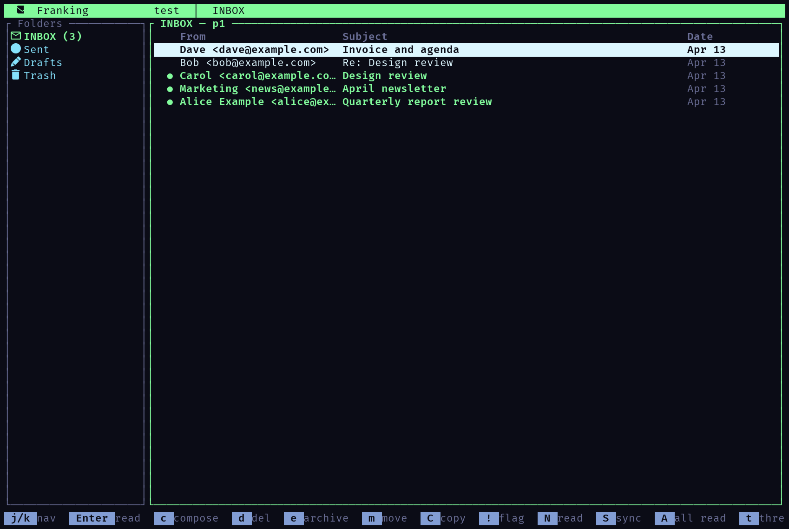
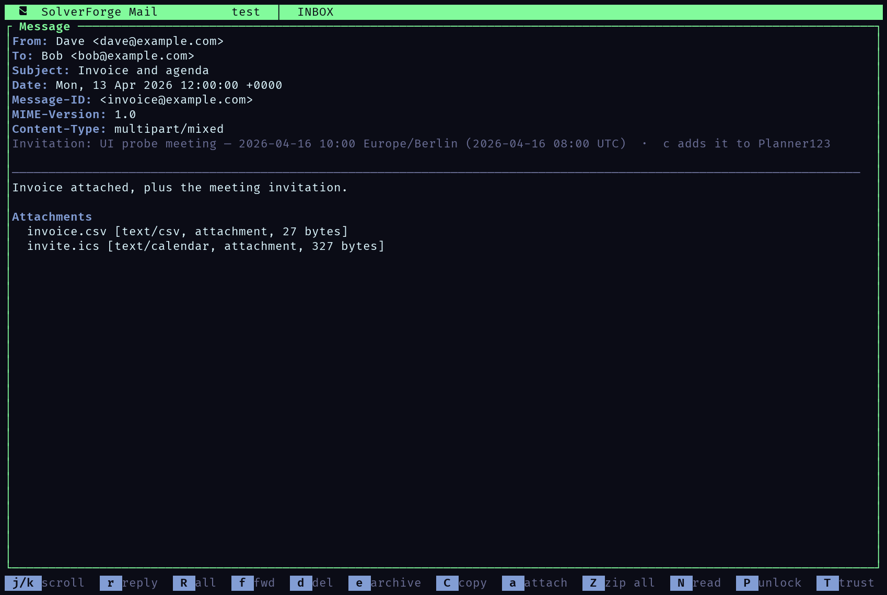
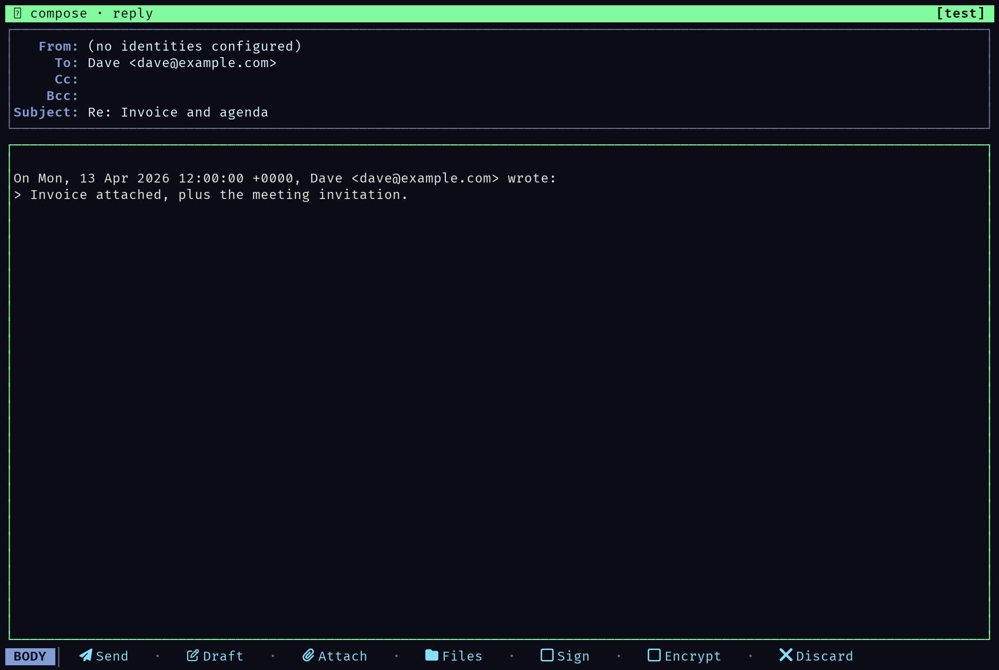
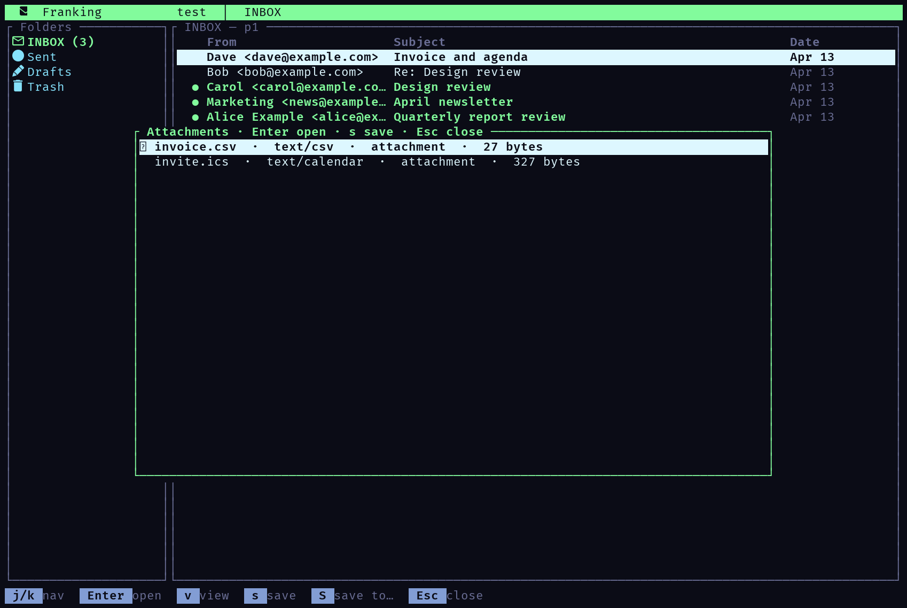
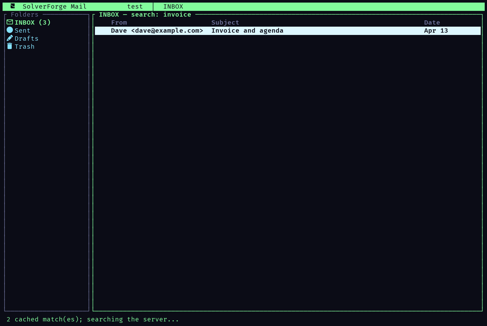
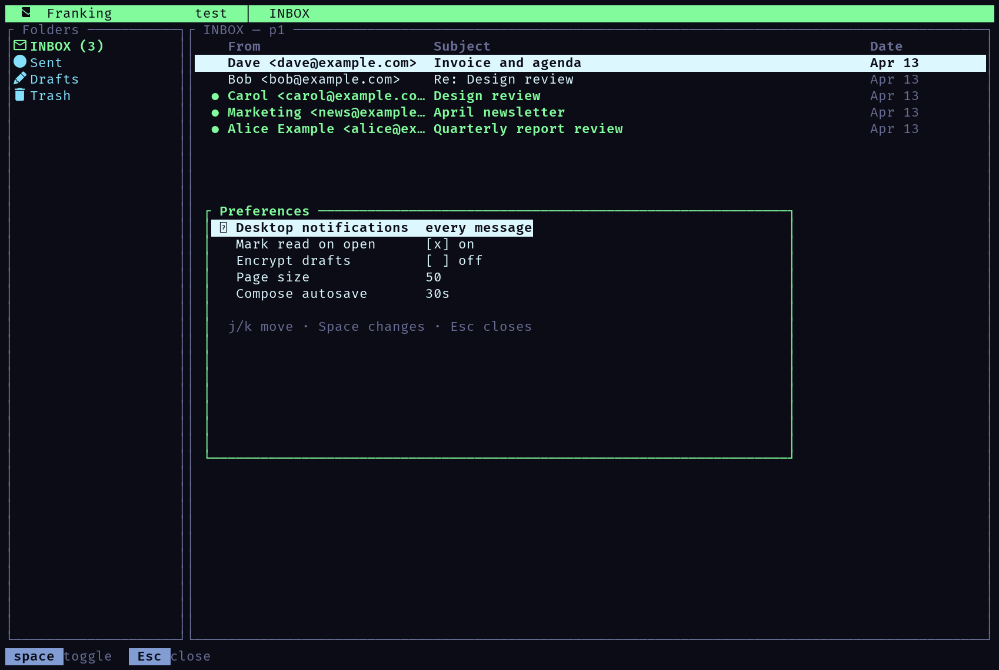
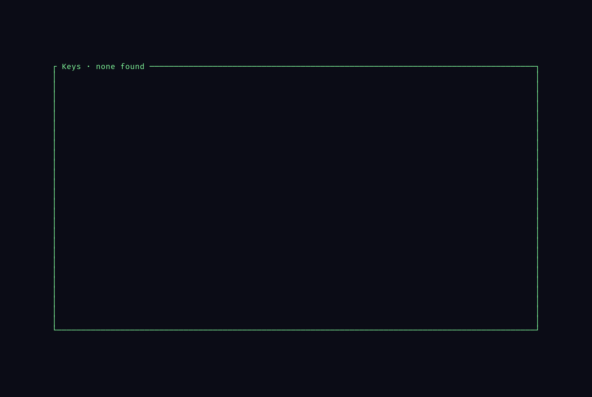
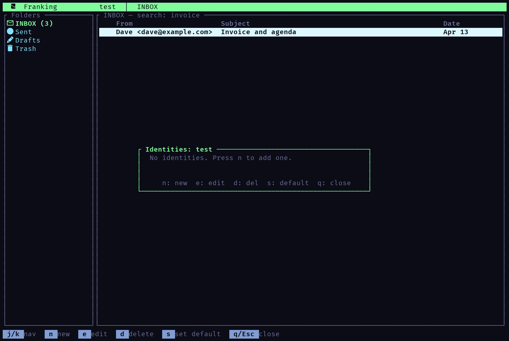

<div align="center">

  

  <br />

  [](https://github.com/blackopsrepl/Franking/actions/workflows/ci.yml)
  [](https://github.com/blackopsrepl/Franking/tags)
  [](https://www.rust-lang.org)
  [](https://ratatui.rs/)

</div>

# Franking

A spiffy ratatui-based TUI email client with an app-owned mail layer, native
maildir support, and native IMAP/SMTP transport for DB-backed accounts.

## Screenshots

Every screenshot below is the running application: the images are rendered from
the app's own cell grid, with the colours it chose.

<table>
  <tr>
    <td width="50%"></td>
    <td width="50%"></td>
  </tr>
  <tr>
    <td><b>Folders and messages</b> — unread counts, per-account folders, threaded and flat views, server-side ordering.</td>
    <td><b>Reader</b> — headers, attachments, and a calendar invitation shown with its timezone.</td>
  </tr>
  <tr>
    <td></td>
    <td></td>
  </tr>
  <tr>
    <td><b>Compose</b> — reply, forward, attachments, PGP and S/MIME toggles, save-as-draft.</td>
    <td><b>Attachments</b> — preview in place, save one, or write them all into an archive.</td>
  </tr>
  <tr>
    <td></td>
    <td></td>
  </tr>
  <tr>
    <td><b>Search</b> — cached matches appear at once, the server result replaces them; the scope cycles folder → all folders → all accounts.</td>
    <td><b>Preferences</b> — notifications rule, mark-read, draft encryption, page size, autosave.</td>
  </tr>
  <tr>
    <td></td>
    <td></td>
  </tr>
  <tr>
    <td><b>Key material</b> — import, generate, export, and delete PGP keys.</td>
    <td><b>Identities</b> — per-account From addresses, signatures, and Sent mailbox.</td>
  </tr>
</table>

## Quick Start

```bash
# Run from source with a specific account
cargo run -- --account test
cargo run -- --account icloud

# Set up accounts
cargo run -- --setup
```

## Features

- **Non-blocking I/O** - Background workers for all mail operations
- **Relative timestamps** - "2h ago", "Yesterday", "Mon"
- **Threading support** - Press `t` to toggle threaded view; replies nest under their parent and server-side `THREAD` is used when available
- **Auto-refresh** - New mail check every 60 seconds
- **Folder unread counts** - Shows (3) badge on folders
- **Mouse support** - Click to select, scroll wheel works
- **Multi-account** - Switch with Ctrl+a; an "All Inboxes" folder merges every account's inbox when more than one account is configured
- **Account-scoped mail triage** - In an inbox, `v` cycles Screening, Inbox, Reading, Receipts, Blocked, then the unfiltered server view. `1`-`5` routes the selected sender for the receiving account; see [mail workflow](WORKFLOW.md).
- **Follow-up queues** - `y` marks a message Reply later, `Y` saves it for reference; `L`/`D` open the respective account-scoped queues, including from All Inboxes
- **Quiet conversations and resurfacing** - `M` quiets (or restores) a conversation so new replies stop demanding attention; `b` sets a delay (30m, 2h, 1d) after which the conversation floats back to the top of the list
- **Local annotations** - `i` writes a private note shown above the message; `%` renames a subject for your eyes only, and `x` places a single message in another lane
- **Attachment library** - `Ctrl+l` lists attachments from cached mail across accounts; Enter opens the source message
- **Read together** - `T` reads the selected messages, or the cursor row, in one numbered scroll
- **Bypass token and cover** - Preferences holds a per-account token that lifts screening for a trusted stranger's subject; a cover hides previously seen Inbox mail until `V`
- **Focus & reply** - `F` works the Reply later queue one message at a time: `n`/`p` move, `r`/`R` reply, `d` done
- **Snippets** - `Ctrl+n` in compose inserts reusable text; `s` saves the current body as a snippet
- **Text clips** - `*` in the reader saves an excerpt; `Ctrl+k` lists clips, Enter copies one to the clipboard
- **Fast keyboard navigation** - j/k and g/G in list/message views, plus direct multiline editing in compose
- **Smart error handling** - Typed mail diagnostics and clean user-facing errors
- **Structured message reader** - MIME-aware message content with one canonical HTML-first render path
- **Address book** - Contacts with name, email, phone, org, notes, tags
- **Contact import** - vCard (.vcf) and Google CSV import
- **Auto-harvest contacts** - Captured from sent/received mail
- **Sender identities** - Multiple From addresses per account with default
- **Local SQLite database** - Contacts and identities stored in `~/.local/share/franking/mail.db`
- **Safe database upgrades** - Versioned migrations preserve accounts, contacts, identities, messages, and local decisions; unsupported versions fail without replacing the database
- **App-owned account store** - Accounts, endpoints, auth bindings, and secret references live in SQLite
- **Keyring-backed secrets** - Password and app-password flows store secret IDs in the app and raw secrets in the OS keyring
- **Account discovery** - Add an account by email: Google/iCloud/Outlook presets, Mozilla autoconfig, Microsoft Autodiscover, then RFC 6186 SRV
- **Attachments** - Attach files on send; download attachments from received mail
- **Drafts** - Save a draft and resume it from the Drafts folder; the draft is removed after sending
- **Security indicators** - SPF/DKIM/DMARC verdicts from `Authentication-Results`, PGP/MIME and S/MIME structure detection, and OpenPGP/S/MIME verification and decryption
- **Crypto keyring** - public/secret keys under `~/.local/share/franking/keys` verify and decrypt OpenPGP (inline and PGP/MIME) and S/MIME (PKCS#7 signed/enveloped)
- **Calendar invitations** - `text/calendar` events show their summary and time with its timezone, cancelled events are marked, and `c` hands the invitation to Planner123 (`planner123-cli ical import`)
- **Desktop notifications** - Quiet by default: `notify-send` for accepted Inbox senders when the IDLE watcher fires, with all/contacts/off preferences
- **Offline cache** - Listings and search fall back to the local store when the server is unreachable
- **Mark read/unread** - Press `N` to toggle the Seen flag

## Keybindings

### Global
- `Ctrl+c` / `Ctrl+q` - Quit
- `Ctrl+a` - Switch account
- `Ctrl+r` - Refresh
- `?` - Help
- `F1` - Help from any view (including compose); `g`/`G` jump to the start/end

### Envelope List
- `j`/`k` - Navigate up/down
- `Enter` - Read message
- `c` - Compose new
- `d` - Delete
- `m` - Move to folder
- `!` - Toggle flag
- `N` - Toggle read/unread
- `A` - Mark all read
- `t` - Toggle threaded view
- `/` - Search
- `Tab` - Focus folders
- `Ctrl+b` - Open contacts
- `I` - Open identities

### Message View
- `j`/`k` - Scroll
- `q`/`Esc` - Back to list
- `r` - Reply
- `R` - Reply all
- `f` - Forward
- `d` - Delete
- `a` - Download attachments
- `N` - Toggle read/unread

### Compose View
- `Tab` / `Shift+Tab` - Next/previous compose field
- `Up` / `Down` in headers or action bar - Previous/next compose field
- Typing in header text fields edits them directly
- `Enter` on the `From` field cycles identities
- `Enter` on header text fields advances to the next compose field
- `Enter` on action buttons activates the focused action
- `Esc` on the action bar returns focus to the body
- `Ctrl+c` / `Ctrl+q` - Discard compose
- In **Body** focus: type directly in the multiline editor
- `Ctrl+f` in the body opens in-body search; `Enter`/`F3` repeats forward and `Shift+F3` repeats backward
- Discard confirmation modal: `y` confirms, `n`/`Esc` cancels

### Mouse
- Scroll wheel - Navigate/scroll
- Left click - Select folder/envelope
- Right click - Go back (in message view)

## Input Architecture (Compose)

Compose input is resolved in two layers:

1. **Context builder (`App::compose_key_context`)** maps runtime compose state into a compact context:
   - Focus bucket: `From` / `Header` / `Body` / `ActionBar`
   - Popup flags: autocomplete visible, discard-confirm visible
2. **Contextual resolver (`resolve_compose_with_context`)** applies deterministic priority rules:
   - Discard-confirm modal interception (`y`, `n`, `Esc`)
   - Global compose shortcuts (`Ctrl+c`, `Ctrl+q`)
   - Autocomplete navigation/accept interception
   - Compose shell controls (`Tab`, `Shift+Tab`, non-body `Up`/`Down`, action-bar activation)
   - Passthrough to the focused compose field

### Why this design
- Keeps compose ownership explicit while the body editor stays focused on text editing.
- Keeps compose behavior explicit and testable with a single resolver function.
- Makes modal interactions predictable by using a clear precedence order.
- Tracks `dirty` from actual text mutations instead of inferring it from raw body keys.

### Best-practice target outcome
For this use case, the ideal architecture is:
- A **single authoritative input router per view** (Compose already follows this pattern).
- State modeled as explicit focus buckets + overlays.
- Pure key-resolution functions with unit tests for each mode interaction.
- Minimal side effects in key resolver; side effects happen in `App` action handlers.

### One-pass, low-regression delivery strategy
To improve safely in one pass:
1. Keep behavior changes isolated to the compose resolver (`resolve_compose_with_context`).
2. Encode precedence explicitly (modal > shortcut > popup > compose shell > focused-field passthrough).
3. Add regression tests for each precedence boundary.
4. Avoid moving side-effectful logic into resolver code.

## Account Setup

The app supports multiple account types:

### Test Account (Local Maildir)
Already configured with sample emails:
```bash
cargo run -- --account test
```

### Real Accounts
Run the setup wizard:
```bash
cargo run -- --setup
```

Supported setup flows inside the wizard:
- **Generic IMAP/SMTP**: Native app-owned IMAP read + SMTP send using SQLite account metadata and OS-keyring secrets
- **iCloud**: Native app-owned endpoint presets with app-password storage in the OS keyring
- **Gmail OAuth**: Native browser-based OAuth bootstrap with app-owned token refresh and SQLite-backed metadata
- **Outlook OAuth**: Native browser-based OAuth bootstrap with app-owned token refresh and SQLite-backed metadata
- **Auth source of truth**: SQLite stores account definitions, endpoints, auth bindings, OAuth state, and secret references; raw secrets stay in the OS keyring

## Architecture

- **TEA pattern** - The Elm Architecture (Model, Update, View)
- **Async worker pool** - Background threads for all I/O
- **Channel-based IPC** - mpsc for result passing
- **Mail service boundary** - `MailService` trait isolates UI/worker code from transport details
- **Shared MIME parser** - Raw messages are parsed once and rendered as structured content
- **Theme support** - Reads SolverForge colors.toml
- **Zero dependencies** on async runtime (no tokio)

## Troubleshooting

### No accounts working
Check the local maildir test account first. If this fails, the backend/runtime is broken rather than remote auth:
```bash
cargo run -- --account test
```

Franking expects:
- no external dependencies for the local `test` maildir account
- the system keyring/`secret-tool` for password, app-password, and OAuth token storage
- network reachability to the configured IMAP and SMTP endpoints for remote accounts

### Authentication errors
- **Generic IMAP/SMTP**: Re-open `--setup`, confirm the endpoint/port pair, and verify the stored keyring secret matches the server login.
- **iCloud**: Use an app-specific password, not your Apple ID password. If you keep `~/.authinfo.gpg` for other tooling, verify it still decrypts in this session.
- **Gmail/Outlook OAuth**: Re-open `--setup`, run the provider flow again, and verify the stored client credentials match the OAuth app you registered with the provider.
- **Local `test` account failing**: This is not an auth issue. Fix backend discovery, config loading, or local maildir paths first.

### Keyring issues
```bash
# Check if keyring is accessible
secret-tool store --label="test" service test user test
# (enter any password)
secret-tool lookup service test user test
```

### GPG-backed auth
```bash
# Check that the iCloud auth file decrypts in this session
gpg -q --for-your-eyes-only -d ~/.authinfo.gpg | head
```

## Development

Schema changes require an ordered migration in `src/db/schema_migrations.rs`
and an increment of `SCHEMA_VERSION` in `src/db/connection.rs`. Update the
fresh-install DDL in `src/db/schema.rs` too. Startup applies migrations in one
transaction before loading mail, and a newer, malformed, or unversioned
existing database is left intact with an error instead of being reset.

```bash
# Build
cargo build --release

# Test
cargo test

# Live integration tests: Dovecot (IMAP + ManageSieve) and Mailpit (SMTP) in
# throwaway containers, removed again on exit (KEEP=1 leaves them running)
make live-test

# Local CI-style validation
make ci

# Interactive setup wizard
cargo run -- --setup

# Run with specific account
cargo run -- --account test
```

## CI Status

GitHub Actions now runs the same core validation as local development:

```bash
make ci
```

## Files

```
franking/
├── setup-accounts.sh         # Interactive account setup wizard
├── src/
│   ├── main.rs              # Entry point, terminal setup, CLI modes
│   ├── app.rs               # TEA state machine
│   ├── setup.rs             # Interactive account setup wizard
│   ├── worker.rs            # Background thread pool
│   ├── event.rs             # Terminal event handling
│   ├── keys.rs              # Keybinding definitions
│   ├── theme.rs             # Color theme loader
│   ├── mail/
│   │   ├── service.rs       # App-facing mail service boundary
│   │   ├── remote/          # Native IMAP/SMTP transport
│   │   │   ├── next/        # Commands on the app-owned IMAP client
│   │   │   └── session/     # Transport, codec reading policy, pool, IDLE
│   │   ├── message.rs       # Structured message content + display modes
│   │   ├── mime.rs          # Shared raw-message MIME parser
│   │   ├── pgp.rs           # PGP verify/decrypt/key generation
│   │   ├── planner123.rs    # Handing invitations to Planner123
│   │   ├── smime.rs         # S/MIME verify/decrypt
│   │   ├── sieve.rs         # ManageSieve script management
│   │   ├── maildir.rs       # Native local maildir backend
│   │   └── account_store.rs # App-owned account metadata store
│   └── ui/
│       ├── envelope_list.rs # Email list with relative dates
│       ├── folder_list.rs   # Sidebar with unread counts
│       ├── message_view.rs  # Structured message reader
│       ├── account_list.rs  # Account switcher
│       └── ...              # Other UI components
└── tests/                   # 54 comprehensive tests
```
